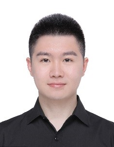

## EDUCATION
2016-Present
- Candidate for Master of Medicine in Surgery (Orthopedics)
  - Tongji University School of Medicine

2011-2016
- Bachelor of Medicine in Clinical Medicine
  - Hunan University of Chinese Medicine (HUCM)

## PUBLICATIONS & PATENTS
- [**Cai, Y.**, Guo, L., Shen, H., An, X., Jiang, H., Ji, F., & Niu, Y. Degradability, bioactivity, and osteogenesis of biocomposite scaffolds of lithium-containiD.docxng mesoporous bioglass and mPEG-PLGA-b-PLL copolymer. International journal of nanomedicine. 2015, 10, 4125-4136.](D.pdf) 
- **Cai, Y.**, Li, L., & Lu, F. Roles of nuclear factor-κB signaling pathway in patients with rheumatoid arthritis. Medical journal of Chinese people's health. 2015, 27(16), 70-72. (In Chinese)
- **Cai, Y.**, & Xu, W. Review on the relationship between inflammation and ossification in ankylosing spondylitis based on ossification-related signaling pathways. Chinese journal of rheumatology. 2015, 19(6), 428-431. (In Chinese)
- Peng, G., **Cai, Y.**, Li, M., Xiang, K., & Chen, L. Research progress of signaling pathways in renal interstitial fibrosis. Progress in modern biomedicine. 2015, 15(24), 4794-4796. (In Chinese)
- Zhang, S., Wang, W., Zou, L., Yan, Z., **Cai, Y.**, & Lu, F. Acupoints heat-sensitive moxibustion in the application of traditional Chinese surgery. Chinese acupuncture & moxibustion. 2016, 36(1), 109-112. (In Chinese)
- Zhang, S., Wang, W., Shen, D., Yan, Z., **Cai, Y.**, Lu, F., & Yu, W. Prof. Yu Wenqiu's experience in treating miscellaneous surgical diseases. Chinese journal of traditional Chinese medicine. 2015, 30(5), 1628-1631. (In Chinese)
- Zhang, S., Shen, D., Wang, W., Lu, F., Yan, Z., & **Cai, Y.** Prof. Yu Wenqiu's one proven case of treating acne based on traditional Chinese medical theory on kidney and bladder. Jiangxi journal of traditional Chinese medicine. 2015, (11), 49-50. (In Chinese)
- Zhang, S., Wang, W., Zhou, S., Na, J., Yan, Z., Zhang, J., **Cai, Y.**, Deng, S., & Lu, F. Application of acupoints heat-sensitive moxibustion in dermatology. Journal of clinical acupuncture and moxibustion. 2015, (6), 88-90. (In Chinese)
- Zhang, S., Wang, W., Lu, F., Yan, Z., Qiu, L., & **Cai, Y.** Combination of Jin Suo Gu Jing Wan with 654-2 acupoints injection for treatment of spermatorrhea: a clinical evaluation of 40 cases. Collected by 14th academic conference of andrology of Traditional Chinese Medicine Association. 2014, 35, 41-43. (In Chinese)
- **Cai, Y.** Growth - college students’ scientific research records. Journal of Hunan University of Chinese Medicine. 2014, (266). (In Chinese)
- **National Invention Patent in China**: Lu, F., Xiang, Q., Li, Z., He, X., Hao, L., Tang, S., **Cai, Y.**, & Li, Y. A method to produce forage via fermentation of dregs from Liu Wei Di Huang Wan, No.CN201310736812.8, 2014.

## WORKING EXPERIENCES
Shanghai Tenth People’s Hospital of Tongji University
- 08/2016-Present: Surgical Resident Doctor
  - Did rotations in different Surgical departments including spinal surgery, trauma orthopedics, abdominal surgery, thyroid and breast surgery, etc., had a deeper understanding of the diseases like osteoarthritis, ankylosing spondylitis, thyroid and breast tumors, and metabolic syndrome, etc. 
  - Participated in disease diagnosis and treatment, and assisted professors in completing surgeries.
  - Consolidated the skills of surgical procedures (scrubbing, sterile gowning and gloving, suturing, incising), imaging diagnosis, femoral central venous catheterization, CPR, etc.

Shanghai Changhai Hospital of Second Military Medical University       
- 07/2012-09/201: Medical Intern
  - Learned basics surgical skills: scrubbing, sterile gowning and gloving, draping, suturing
- 04/2015-07/2015: Intern Doctor                                                     
  - Finished clinical rotations in the departments of internal medicine, surgery, obstetrics and gynecology, rheumatology, and mastered the basic skills of medical history collection, physical examination, imaging diagnosis, medical treatment, etc. 

## RESEARCH EXPERIENCES
**Study on Roles of NF-ΚB Signaling Pathways in Ligament Ossification in Ankylosing Spondylitis(AS)**   

- 03/2013-07/2015: National College Students Innovation and Entrepreneurship Training Program
  - **Advisor**: Prof. Lu Fangguo
  - **Position**: Project Designer and Leader of 3-Member Group
  - **Responsibilities**: 
    - Studied references about AS pathogenesis, animal model, and NF-κB signaling pathway, learned the skills of laboratory animal techniques, IHC, ELISA, DNA and protein extraction, and western blotting, and designed the research subject.
    - Obtained clinical specimens of patients with AS undergoing hip replacement, utilized IHC to detect expression of NF-κB signaling pathway transcription factor p65, downstream gene A20 and Wnt signaling pathway transcription factor β-catenin and osteogenic signal osteocalcin in hip ligament tissues.
    - Quantified the protein expression in IHC images by imageplus6.0, and did statistic analysis on the expression differences of p65, A20, OCN and β-catenin proteins in AS and control groups using SPSS.
    - Innovation: Explored the molecular mechanism of AS ligament ossification, used AS fibroblasts as target cells to study the molecular mechanism of pathological osteogenesis

**Study on advanced Bio-composite Scaffolds of Mesoporous Bioactive Glass Containing Different Metal Ions and mPEG-PLGA-PLL Copolymer for Bone Defect Repair**             

- 07/2012-06/2017: Shanghai Changhai Hospital Innovation and Research Project
  - **Advisor**: Prof. Niu Yunfei
  - **Position**: Main participator of 5-Member Group
  - **Responsibilities**: 
    - Designed the Li-containing mesoporous bioglass/mPEG-PLGA-PLL bio-composite scaffold cooperated with materials experts, and learned modeling methods of rabbit bone defect by surgery, and techniques of bone tissue H&E staining, 3D scaffold cell culture 
    - Mainly performed the in vivo experiments and verified the osteogenic effects of new materials, established rabbit’s hind limb bone defect models and implanted the bio-composites
    - Finished histological evaluation of osteogenic effects of new materials after implantation in vivo, and did quantitative analysis of differences in new bone formation area between mesoporous and control group using Image-Pro Plus 6.0 and GraphPad Prism

**The Anti-arthritic Effect and Molecular Mechanisms of Natural Compounds in Chinese Herbal Formula against Rheumatoid Arthritis(RA)** 

- 09/2014-05/2016: Hunan Province College Students Research Learning and Innovation Experimental Project
  - **Advisor**: Prof. Cai Xiong
  - **Responsibilities**: 
    - Studied the establishment of RA animal models and pharmacodynamics evaluation methods in Hunan Provincial Key Laboratory of Diagnostics of Chinese Medicine, and read references on anti-inflammatory and immunomodulatory effects of natural compounds of traditional Chinese medicine and related signaling pathways
    - Established experimental models of arthritis in rats and induced the adjuvant-induced arthritis (AIA) by a single subcutaneous injection of the ground mycobacterium tuberculosis (MT) suspension 
    - Performed clinical evaluation of the development of AIA rats, including disease progression and severity by arthritic scoring on scheduled points. Lesions on all four paws of each rat were graded from 0 to 4 according to the extent of both edema and erythema of the periarticular tissues.

## SELECTED HONORS & AWARDS
- Excellent Graduate of Hunan Province 2016
- Second-Class Scholarship of HUCM (Three times) 2012; 2013; 2015
- First Prize of HUCM College Students' Annual Tennis Competition 2011
- Third Prize of HUCM College Students' Functional Science Experiment Skill Contest  2013
- Second Prize of HUCM College Students' Innovation Forum and Experimental Design Competition 2013
- Excellent Worker of School of Medicine, HUCM (Twice)  2011; 2012
- Merit Student of HUCM  2012; 2013    

## OTHER INFORMATION
- **Technical Skills** 
  - MS Office Software, Image-Pro Plus, GraphPad Prism
- **Qualification**
  - Successfully Passed 2017 Clinic Practicing Physician Examination in China
- [**CITI Program Course**](certification.pdf)
  - [Completed Human Research Data or Specimens Only Research 1-Basic Course (set by Massachusetts Institute of Technology Affiliates)](certification.pdf)
- **Volunteer Activity**
  - Offered Charity Clinics in Lianfeng Community, Hunan, China
- **Hobbies**
  - Tennis, Swimming, Calligraphy, Seal Cutting

